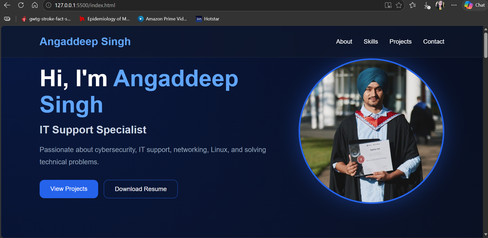
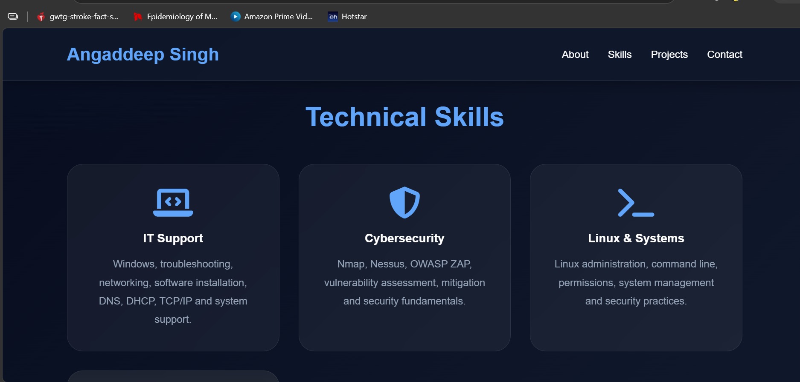
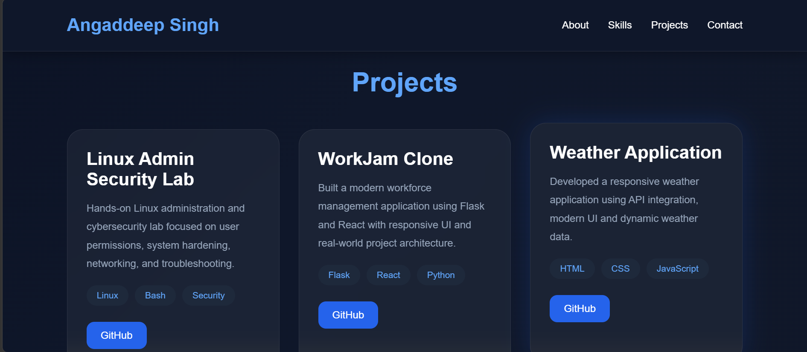
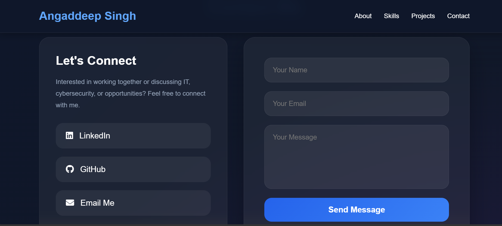

# 🚀 Angaddeep Singh - IT Portfolio Website

A modern and professional personal portfolio website built to showcase my **IT Support**, **Cybersecurity**, **Linux Administration**, and **Web Development** skills.

This portfolio highlights my technical skills, projects, certifications, and professional profile for IT opportunities in New Zealand.

---

## 🌐 Live Portfolio
🔗 Live Website :             https://angad198.github.io/Portfolio-/

🔗 **LinkedIn:** https://www.linkedin.com/in/angad-singh-501971204/

---

# ✨ Features

✅ Modern Premium UI Design  
✅ Responsive Layout (Desktop + Mobile)  
✅ Professional About Me Section  
✅ Technical Skills Showcase  
✅ Real IT & Cybersecurity Projects  
✅ Resume Download Option  
✅ Contact Form with Email Integration  
✅ GitHub & LinkedIn Integration

---

# 🛠️ Technologies Used

- HTML5
- CSS3
- JavaScript
- Font Awesome
- Git & GitHub

---

# 📸 Website Preview

## 🏠 Homepage



---

## 💻 Technical Skills



---

## 🚀 Projects Section



---

## 📩 Contact Section



---

# 📂 Project Structure

```txt
Portfolio/
│── index.html
│── style.css
│── script.js
│── README.md
│
├── assets/
│   ├── profile.jpg
│   ├── Resume.pdf
│   └── screenshots/
│       ├── homepage.png
│       ├── skills.png
│       ├── projects.png
│       └── contact.png
